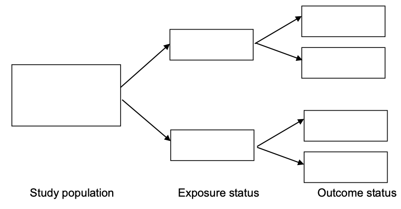
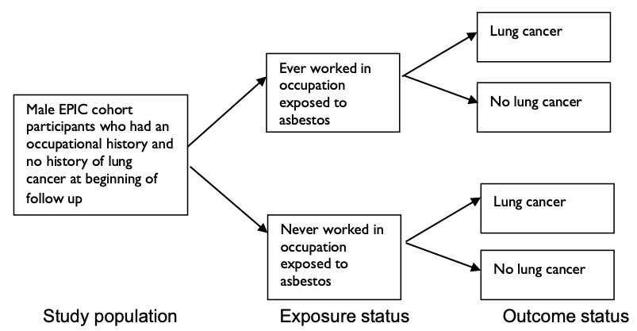
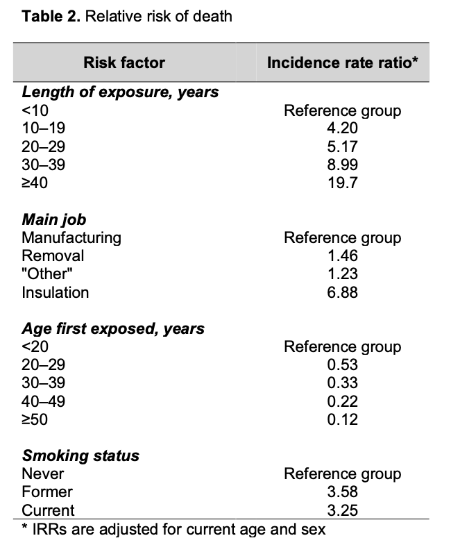

class: middle
# Objectives

- Describe the principal design features of cohort studies. 

- Explain the strengths and weaknesses of cohort studies. 

- Describe the analytical approaches commonly used for cohort studies. 


---
class: middle 

# Cohort

"Any designated group of individuals who are followed or traced over a period of time." --- Rothman 1998

```{r echo=FALSE, eval=FALSE}
library(DiagrammeR)
mermaid("
graph LR
  A((Population))==>B[People <br> without<br> disease]
  B==>C[Exposed]
  B==>D[Not Exposed]
  C==>E[Disease]
  C==>F[No Disease]
  D==>G[Disease]
  D==>H[No Disease]
", width = 800, height = 400)

```


---
class: top
background-image: url("./fig/Direction.png")
background-position: 50% 50%
background-size: contain

## Direction of enquiry


---
class: middle

# Key steps 

1. What is the hypothesis ?

2. Identify groups of individuals to be studies

3. Define primary exposure & its measurement

4. Define potential confounding variables & their measurement

5. Define outcome & its measurement 

6. Analysis the data

7. Result interpretation

---
class: middle

# Defining exposure groups 


- Occupational: pilots; bus drivers; doctors; nurses; workers with a specified industrial exposure, etc. 

- Infectious: hepatitis A/B/C virus; vaccines; etc.

- Social/biological: breast feeding; stress; smoking; drinking, etc. 

---
class: middle

# Types of cohort study

- **Concurrent** Cohort Studies: new exposure data is collected on cohort members at the start of (and sometimes also during) follow-up

- **Historical** Cohort Studies: use pre-existing exposure histories that have been assembled for cohort members in the past

Choice may depends on: 

study question, logistics, costs, quality of exposure data, etc.


---
class: middle 

# Concurrent vs. Historical

- Philosophical 

    - Cohort studies are always **prospective** as they look forward from exposure to disease
    
- Cohort studies sometimes called **historical** if the use historical data on exposure and disease.


---
class: middle

# Data collection

- High degree of control over data collection (type and quality)

- Possible improved sampling of patients 

- Can be very very very time consuming

- Very very very expensive


---
class: top, center
background-image: url("./fig/F3.large.jpg")
background-position: 50% 100%
background-size: contain


## British Doctors Study

---
class: middle

# British Doctors Study<sup>[1]</sup>

.med[
- Groups 
    - 34439 male doctors born 1900-1930 
- Exposure 
    - Smoking history from questionnaire
- Potential confounders 
    - Height, weight, BP, alcohol, medical history, etc.
- Follow-up 
    - 1951-2001
- Outcome 
    - Death and cause of death (death certificate)
- Analysis: Rate ratio by smoking history
]

.tiny[[1] R. Doll et al. “Mortality in relation to smoking: 50 years’ observations on male British doctors,” BMJ 2004.]


---
class: middle

## Karonga Prevention Study<sup>[1]</sup>

- 197 HIV + <br> 396 HIV - <br> baseline: late 1980 
- Followed up to late 1990s
- Death rate was 93.3 per 1000 person-years in the HIV + group
- 11.3 in the initially HIV - group
- Hazard Ratio: <br> 10.8 [95% confidence interval (CI) 7.4–15.6].

.tiny[[1] A. C. Crampin et al., “Long-term follow-up of HIV-positive and HIV-negative individuals in rural Malawi,” AIDS, 2002.]


---
class: top, left
background-image: url("./fig/nejm199509143331101_f2.jpeg")
background-position: -180% -320%
background-size: cover

# Nurses Health Study<sup>[1]</sup>

.med[[1]J. E. Manson et al., “Body weight and mortality among women,” New England Journal of Medicine, 1995.]


---
class: middle

# Source of cohorts


- Electronic Healthcare database

    - Already collected
    - Can be used for most study designs
    - Very large populations
    - Little control over quality and type of information
    
---
class: middle

# Source of cohorts

-  Registries 
    
    - Prospective
    - Often used for some rare/infectious diseases, or cancer
    - Better control over data collection
    - Long to conduct
    - Expensive
    
---
class: middle

# Cohort studies 

.pull-left[
Advantages: 

- Multiple outcomes
- Rare exposures 
- Less biased measure of exposure
- Population rates
- Temporal sequence
]

.pull-right[
Disadvantages: 

- Money and time consuming
- Misclassification of exposure and outcome
- Loss to follow-up
- Inefficient for rare outcomes
- Bias and confounding still matter
]


---
class: middle

# Example: multiple outcomes

The Karonga Prevention Study:  A. C. Crampin et al., “Long-term follow-up of HIV-positive and HIV-negative individuals in rural Malawi,” AIDS, 2002.

- Originally set up to look at leprosy (ハンセン病)

- Was adapted to study HIV, TB, and other outcomes. 


---
class: middle

# Example: rare exposures

Hiroshima and Nagasaki 

- long term follow-up of children exposed to radiation from the nuclear explosions

---
class: middle

# Example: less biased measurement of exposure 

Brain Cancer and mobile phone usage 

- Asking people with brain cancer about previous/historical use may well result in a biased assessment 

---
class: middle

# Example: temporal sequence 

Cholesterol and cancer 

- Some cancer would reduce cholesterol levels: this doesn't mean low cholesterol leads to cancer 


---
class: middle

# Example: money and time consuming

UK Biobank 

- Aims to investigate gene-environment interaction

- 500,000 sample size

- At least 10 years. 

---
class:  middle

# Example: loss to follow-up

Hormone replacement therapy and breast cancer 

- Problem that women who take HRT would be more likely to complete follow-up, 

- while those who do not take HRT would have a much lower follow-up

---
class: middle

# Issues in cohort studies

- Bias:

    - Selection of the population (representativeness)
    - Choice of comparison group <br> (healthy worker effect)
    - Ascertainment of disease status <br> (losses to follow up)
    
    
---
class: middle

# Example of bias: <br> HRT and breast cancer 

- Self-reported drug history

- People on HRT were more likely to be followed 

- Detection bias: patients on HRT more likely to attend their physician than those not, thus they were more likely to have cancer detected early


---
class: middle

# Confounding

- Confounding is about alternative explanations

- It occurs when an estimate of the association between an exposure and an outcome is mixed up with the effect of another exposure on the same outcome, and the two exposures are closely related

---
class: top, left
background-image: url("./fig/CFDNG.png")
background-position: 50% 70%
background-size: contain

# Example: confounding <br> carrying a briefcase to work makes you live longer


---
class: middle

# Reverse causality 

- The association exists because having the outcome leads to the exposure. 

- The begining of a disease is not always obvious (like cancer or maybe diabetes) so we sometimes exclude outcomes within a set period of time of the study start.  
    
    
---
class: middle

# Analytical approaches - Basic

- Compare disease risk or rate in exposed cohort members with unexposed cohort members

$$
\text{Risk} = \frac{\text{N of observed cases}}{\text{N at risk at start}}
$$

$$
\text{Rate} = \frac{\text{N of observed cases}}{\text{Person years at risk}}
$$


---
class: top, left
background-image: url("./fig/follow.png")
background-position: 50% 50%
background-size: contain

---
class: middle

# Risk and Rate

$$
\text{Risk} = \frac{2}{7} = 0.29 
$$

$$
\text{Rate} = \frac{2}{2 + 1.5 + 1 + 2 + 1 + 1.5 + 1} = \frac{2}{10}
$$

$\Rightarrow 0.2$ deaths/person-year 


---
class: middle

# SMR - standardized mortality (morbiditiy) ratio

$$
\text{SMR} = \frac{\text{Observed Deaths}}{\text{Expected Deaths}} = \frac{O}{E}
$$

Expected deaths are the number of deaths that would be expected if age-, sex-, and calendar period rates for the **general population**.


---
class: middle

### Lung cancer mortality in Manchester printers machine assistants relative to the population<sup>1</sup>

- Expected based on England and Wales rates <br> SMR = 179; 95% CI: 144-218

- Expected based on Manchester rates <br> SMR = 122; 95% CI: 98-148


.small[[1] D. Leon, P. Thomas, and S. Hutchings, “Lung cancer among newspaper printers exposed to ink mist: a study of trade union members in Manchester, England.,” Occupational and environmental medicine, vol. 51, no. 2, pp. 87–94, 1994.]


---
class: middle

## Analysis: a simplified example <br> British Doctors Study Lung cancer rates

- Unexposed: life long non-smokers <br> Rate = 0.17 / 1000 men-year

- Exposed: current smokers, more than 24 cigarettes/day <br> Rate = 4.17 / 1000 men-year

- Rate ratio = 24.5

---
class: top, right
background-image: url("./fig/SurvivalAnalysis.png")
background-position: 50% 50%
background-size: contain

## Analysis: survival analysis 

Please refer to the other [slides](https://wangcc.me/basic_suvival/#1) (click here)


---
class: middle

# Interpretation

- Consider possibility of bias, residual confounding

- One study alone not proof

- Consistent evidence with the other cohorts/study designs in differen settings.

- RCT is not always possible


---
class: middle 

# Practical (1)


European Prospective Investigation into Cancer and Nutrition (EPIC) study is a multi-centre prospective cohort study of adults conducted in 23 health centres in 10 European countries. At recruitment, participants were defined as "Exposed" to asbestos (石綿) if they had worked in an occupation defined by labour experts as being at risk of asbestos exposure. 

88,265 cancer-free men were followed for an average of 8.4 years and information was collected about incidenct lung cancer during follow-up. 


---
class: middle 

# Question 1

Fill in the study design framework below:

```{r echo=FALSE}

```

---

class: middle

--
# Answer 1

```{r echo=FALSE}

```

---
class: middle 

# Question 2

Do you think that defining people as **"exposed"** to asbestos on the basis of job title provided an adequate measure of occupational asbestos exposure? 

---
class: middle

--
# Answer 2

- Relatively crude

- Some people may not actually/necessarily have been exposed only because their occupation. 

- Same argument for people defined as un-exposed. 

- No account was taken of the amount/duration of asbestos exposure. 

- In accurate classification may occured. 


---
class: middle 

# Question 3 

People with lung cancer were excluded at baseline, why?


---
class: middle

--
# Answer 3

- Lung cancer cases were excluded because they were no longer **at risk**. 

- Exclude them ensure that the exposure preceded the onset of the disease. 


---
class: middle

# Question 4 

What were the strengths and limitations of using a population-based cohort (rather than a occupational-based cohort) for assessing the association between asbestos exposure and lung cancer risk? 

---
class: middle 

--
# Answer 4

.pull-left[
### Advantage

- more generlisable

- reflect the risk of asbestos exposure among the population

]

.pull-right[
### Limitation

- asbestos is relatively rare exposure

- number of exposed will be small 

- limits the statistical power

]


---
class: middle

# Practical (2)

The Great Britain Asbestos Survey was established in 1971 to monitor death among workers with varying levels of exposure to asbestos. Workers were asked to report their length of employment and type of job (manufacturing, removal, insulation installation, or other)

Participants were flagged through the National Health Service Central Register automatically if any death occured. 

Finally, 15,496 deahts among 98,117 workers followed-up for 1,779,580 person-years.


---
class: middle 

# Question 5

Calculate the average death rate for the cohort during the follow-up, stating the units. For each individual, when would follow-up time begin and end?

---
class: middle

--
# Answer 5

- average death rate = 15,496 / 1,779,580 = 0.0087 = 8.7 deaths per 1000 person-years at risk

- Follow-up should be counted from the date of the first medical examination. It should be end at the last date of follow-up/flagging, or when dies, or lost to follow-up. 

---
class: middle 

# Question 6 

98% of the participants were successfully traced for follow-up through the registration system. Was loss to follow-up a potential source of bias in this study?

--
# Answer 6

Only very few of the participants were lost to follow-up. This means that loss to follow-up would like induced minimal selection bias in this study. 


---
class: middle

# Question 7 


Researchers were interested in which characteristics increased the rate of death among the asbestos workers. Within the cohort, the incidence rate ratios of death were computed using a regression method, adjusting for age and sex. These ratios show the association of age at first exposure, length of exposure, smoking status, and job type with the risk of death. (Table in the next page)

Can the association between asbestos exposure and death be assessed within this cohort?


---
class: inverse
background-image: url("./fig/t1.png")
background-position: 50% 50%
background-size: contain


<!-- ```{r echo=FALSE} -->
<!--  -->
<!-- ``` -->


---
class: middle

--
# Answer 7

- All of the participants were exposed to asbestos. (No comparison group)

- Impossible to assess the association between asbestos exposure and death. 

- However, characteristics of asbestos exposure (length, job type) could be investigated in relation to risk of death. 

---
class: inverse
background-image: url("./fig/t1.png")
background-position: 50% 50%
background-size: contain


---
class: middle

# Question 8 

Describe the association between length of exposure and risk of death. 

--
# Answer 8 

With increasing length of exposure there is increasing risk of death among asbestos workers. (it is a dose-response relationship)

---
class: middle

# Question 9 

Overall, which factors increase the risk of death among people exposed to asbestos? 

--
# Answer 9

- Longer exposure is associated with increase in the death rate. 

- Death rate is 3 times higher among smokers than never smokers

- Relative to manufacturing workers, insulation workers had 6.88 times higher rate. 


---
class: middle, center, inverse

# Thanks


